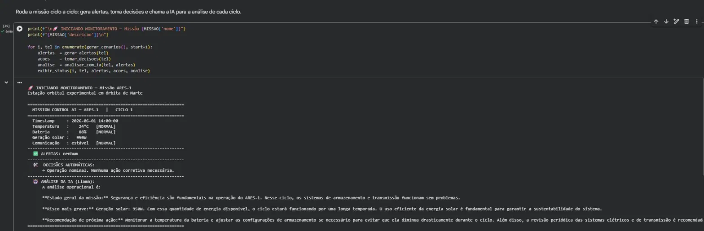
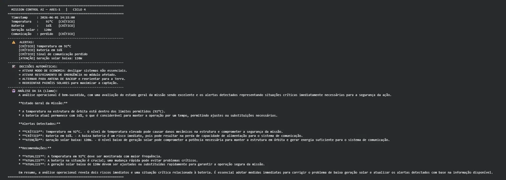

# 🚀 Mission Control AI — ARES-1

**FIAP · Global Solution 2026.1 · Prompt and Artificial Intelligence**

**Integrantes:**
- Herbert Soares de Jesus — RM: 571507
- Gabriel de Almeida Santos — RM: 569395
- Guilherme Garbelini — RM: 571150

## 📌 O que o projeto faz

Sistema de monitoramento de uma missão espacial experimental, escrito em **Python**
e executado no **Google Colab**. O sistema gera **dados simulados** de telemetria
(temperatura, bateria, geração solar e status de comunicação), aplica **lógica de
alertas e de tomada de decisão automática** e usa o modelo de linguagem
**Llama 3.2 (via Ollama)** para produzir, a cada ciclo, uma **análise operacional**
em linguagem natural com base no contexto da missão. Quando a missão entra em
situação crítica, o sistema dispara alertas e ações corretivas automáticas (ex.:
*"bateria < 20% → ativar modo de economia"*).

## 🤖 Como a IA está integrada

- Modelo: **Llama 3.2 1B** rodando localmente no Colab via **Ollama** (sem chave de API).
- A IA recebe um **system prompt** que a coloca no papel de *oficial de controle da
  missão ARES-1* e analisa a telemetria + os alertas de cada ciclo.
- Há um **fallback baseado em regras** caso o modelo não responda, garantindo que a
  demonstração nunca quebre.

## 🛰️ Funcionalidades

- Monitoramento de **4 parâmetros** (temperatura, bateria, geração solar, comunicação)
- Classificação automática em `NORMAL` / `ATENÇÃO` / `CRÍTICO`
- **Geração de alertas** quando os parâmetros saem da faixa segura
- **Lógica de decisão automática** (modo economia, resfriamento, antena de backup, etc.)
- **Resposta automatizada a um cenário crítico** simulado (ciclo 4)
- Análise por IA + modo conversacional opcional com o controle da missão

## 🖼️ Demonstração

## ▶️ Como Executar

Abra o notebook no Google Colab:

[Acessar Notebook]([[https://colab.research.google.com/drive/SEU_LINK_AQUI](https://colab.research.google.com/github/Het0047/mission-control-ai/blob/main/mission_control_ai.ipynb?authuser=2#scrollTo=ad7cef4a)](https://colab.research.google.com/github/Het0047/mission-control-ai/blob/main/mission_control_ai.ipynb))

Execute as células **em ordem, de cima para baixo**. O Ollama e o modelo Llama
são instalados automaticamente nas primeiras células (leva ~1–2 min na primeira vez).

## 🧰 Tecnologias

- Python 3
- Google Colab
- Ollama
- Llama 3.2 1B
- Biblioteca `ollama` (Python)

## 🎥 Vídeo de Demonstração

[Assistir ao vídeo](https://SEU_LINK_DO_VIDEO_AQUI)
